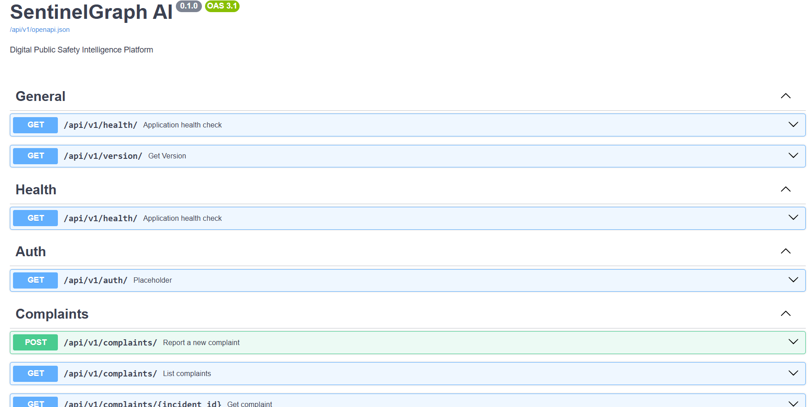
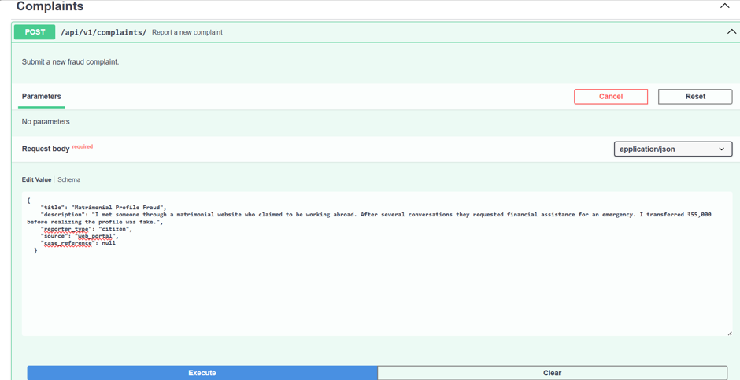
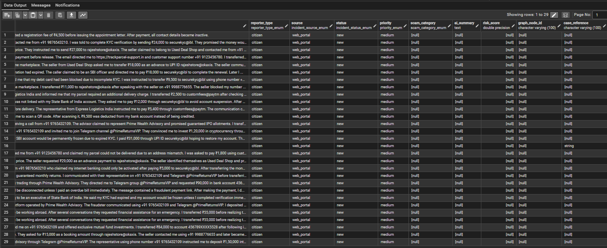

# 🛡️ SentinelGraph AI

<p align="center">
  <h3 align="center">
    AI-Powered Fraud Intelligence Platform using Graph-RAG
  </h3>

  <p align="center">
    Transforming isolated fraud complaints into an intelligent knowledge graph for faster, explainable investigations.
  </p>
</p>

<p align="center">


</p>

---

## 📌 Overview

SentinelGraph AI is an AI-powered Fraud Intelligence Platform developed for the hackathon theme:

> **AI for Digital Public Safety: Defeating Counterfeiting, Fraud & Digital Arrest Scams**

Instead of treating every complaint as an isolated record, SentinelGraph AI extracts fraud-related entities, builds a Neo4j knowledge graph, discovers hidden relationships, and generates explainable AI investigation reports using a Graph Retrieval-Augmented Generation (Graph-RAG) pipeline.

---

# ✨ Features

- 📝 Complaint Registration API
- 🗄️ PostgreSQL Transactional Storage
- 🤖 AI Entity Extraction using Google Gemini
- 🌐 Neo4j Knowledge Graph Construction
- 🔍 Graph Intelligence Queries
- 🕸️ Fraud Ring Detection
- 📊 Risk Analysis
- 🧠 Graph-RAG Investigation Engine
- 📄 AI Generated Investigation Reports
- 📚 Interactive Swagger Documentation
- 📜 Structured Logging

---

# 🏗️ System Architecture

> *(Insert your High-Level Architecture Diagram here)*

```
Complaint
     │
     ▼
FastAPI Backend
     │
     ▼
PostgreSQL
     │
     ▼
Gemini Entity Extraction
     │
     ▼
Graph Builder
     │
     ▼
Neo4j AuraDB
     │
     ▼
Graph-RAG Investigation
     │
     ▼
AI Investigation Report
```

---

# 🚀 Technology Stack

| Layer | Technology |
|--------|------------|
| Backend | FastAPI |
| Language | Python |
| Database | PostgreSQL |
| Graph Database | Neo4j AuraDB |
| AI Model | Google Gemini |
| ORM | SQLAlchemy Async |
| Validation | Pydantic |
| Logging | Loguru |
| Migrations | Alembic |

---

# 📂 Project Structure

```text
sentinelgraph-ai/
│
├── app/
│   ├── api/
│   ├── ai/
│   ├── core/
│   ├── db/
│   ├── graph/
│   ├── repositories/
│   ├── schemas/
│   ├── services/
│   └── main.py
│
├── alembic/
├── tests/
├── requirements.txt
├── README.md
└── .env.example
```

---

# ⚙️ Installation

## Clone Repository

```bash
git clone https://github.com/YOUR_USERNAME/SentinelGraph-AI.git

cd SentinelGraph-AI
```

---

## Create Virtual Environment

```bash
python -m venv venv
```

Windows

```bash
venv\Scripts\activate
```

Linux / macOS

```bash
source venv/bin/activate
```

---

## Install Dependencies

```bash
pip install -r requirements.txt
```

---

## Configure Environment

Create a `.env` file.

```env
DATABASE_URL=

NEO4J_URI=

NEO4J_USERNAME=

NEO4J_PASSWORD=

GEMINI_API_KEY=
```

---

## Run Database Migrations

```bash
alembic upgrade head
```

---

## Start Server

```bash
uvicorn app.main:app --reload
```

Server:

```
http://localhost:8000
```

Swagger:

```
http://localhost:8000/docs
```

---

# 📡 API Endpoints

| Method | Endpoint | Description |
|---------|----------|-------------|
| POST | `/api/v1/incidents` | Register Complaint |
| POST | `/api/v1/investigation` | AI Investigation |
| GET | `/api/v1/graph/...` | Graph Queries |
| GET | `/health` | Health Check |

---

# 📸 Screenshots

## Swagger Documentation



---

## Complaint Registration



---

## PostgreSQL Database



---

## Neo4j Knowledge Graph

> *(Insert Neo4j Screenshot)*

---

## AI Investigation Report

> *(Insert Investigation Report Screenshot)*

---

# 🧠 Graph-RAG Investigation Flow

1. Complaint Registration

2. AI Entity Extraction

3. Graph Construction

4. Graph Persistence

5. Context Retrieval

6. Gemini AI Reasoning

7. Structured Investigation Report

---

# 🎯 Future Enhancements

- 📊 Real-time Monitoring Dashboard
- 🎙️ Voice Scam Analysis
- 🖼️ Counterfeit Image Detection
- 🌍 Multi-language Support
- ☁️ Docker & Cloud Deployment
- 🤝 Law Enforcement Integration

---

# 📖 Documentation

Complete project documentation is available in the repository.

- System Design
- Architecture
- API Design
- Database Design
- Graph-RAG Pipeline
- Implementation Results

---

# 🤝 Contributing

Contributions, ideas, and suggestions are welcome.

Fork the repository and submit a pull request.

---

# 📄 License

This project is licensed under the MIT License.

---

# ⭐ Acknowledgements

- FastAPI
- Neo4j AuraDB
- PostgreSQL
- Google Gemini
- SQLAlchemy
- Pydantic
- Loguru

---

<p align="center">

⭐ If you found this project interesting, consider giving it a star!

</p>
