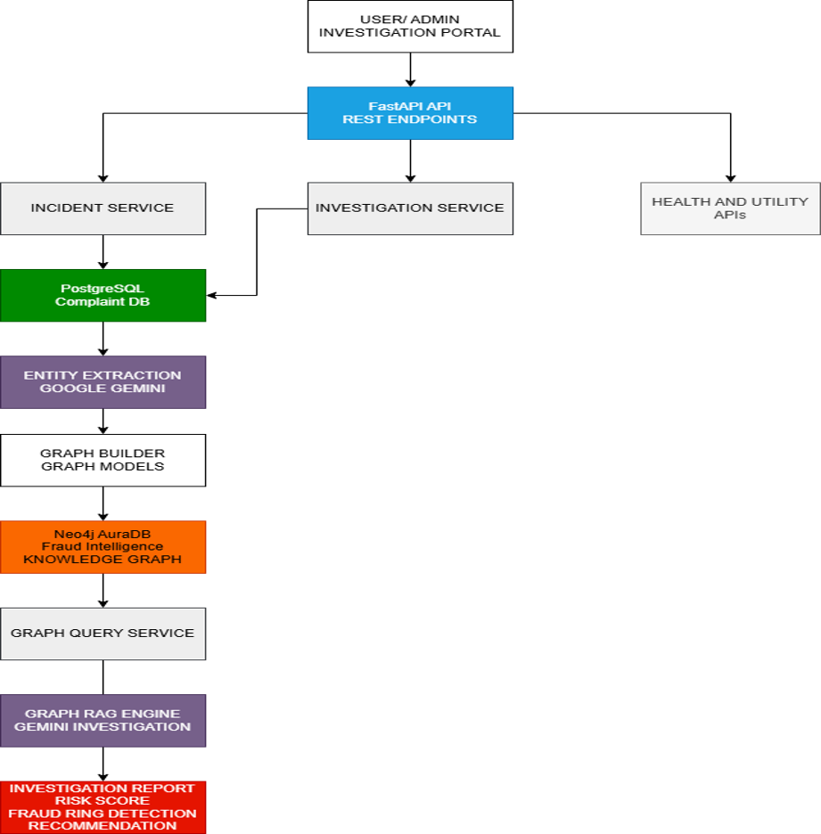
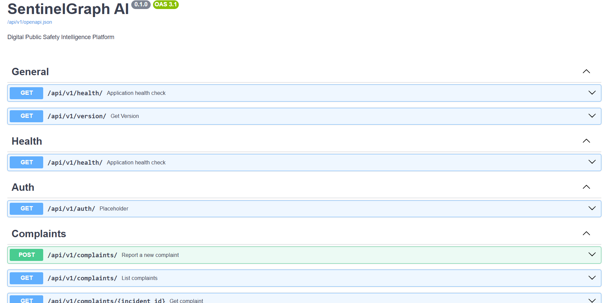
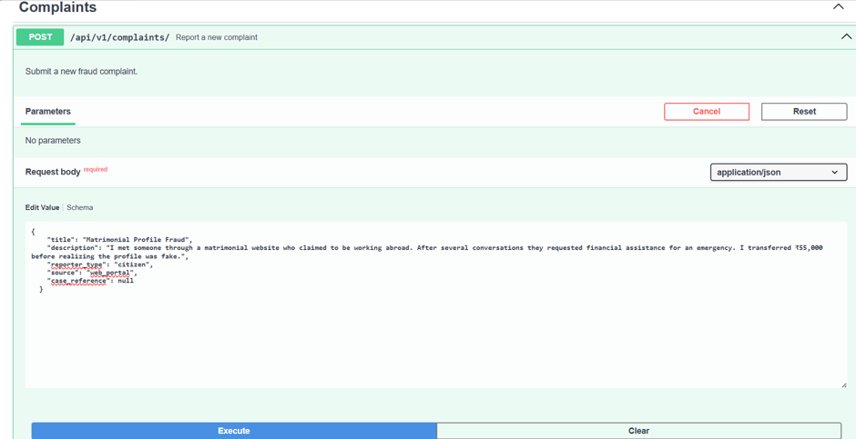
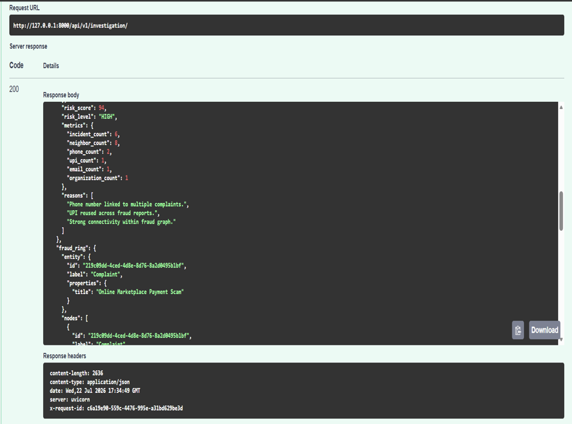

# 🛡️ SentinelGraph AI

<p align="center">
  <h3 align="center">
    AI-Powered Fraud Intelligence Platform using Graph-RAG
  </h3>

  <p align="center">
    Transforming isolated fraud complaints into an intelligent knowledge graph for faster, explainable investigations.
  </p>
</p>

<p align="center">


</p>

---

## 📌 Overview

SentinelGraph AI is a full-stack AI-powered Fraud & Risk Intelligence Platform developed for the hackathon theme:

> **AI for Digital Public Safety: Defeating Counterfeiting, Fraud & Digital Arrest Scams** (Track 02: AI Risk Manager)

Instead of treating every complaint as an isolated record, SentinelGraph AI extracts fraud-related entities, builds an interconnected Neo4j knowledge graph, discovers hidden mule syndicates, and generates evidence-grounded AI investigation reports via a deterministic Graph Retrieval-Augmented Generation (Graph-RAG) pipeline.

The platform provides a unified operations console featuring:
- 📊 **Risk Overview**: Global co-occurrence monitoring, highest-risk entities, and shared infrastructure hubs.
- 🎯 **Interactive Investigation Workspace**: Single-pane triage across phone numbers, UPI VPAs, emails, and complaints.
- 🕸️ **Graph Visualization**: Interactive Cytoscape.js topological network exploration with multi-hop neighbor expansion.
- 📄 **AI Investigation Dossier**: Evidence-grounded, citation-backed investigative findings powered by Google Gemini.
- 🛡️ **AI Governance & Guardrails Console**: Deterministic 3-layer verification pipeline (Schema Validation, Evidence Grounding, Hallucination Detection), live Prometheus telemetry, and golden benchmark specifications.

---

# ✨ Features

- 📊 Full-Stack Fraud Risk Intelligence Dashboard
- 🎯 Interactive Investigation Workspace with Preset Scenarios
- 🕸️ Cytoscape.js Graph Visualization & Neighborhood Traversal
- 🧠 Graph-RAG Investigation Engine with Deterministic Grounding
- 🛡️ 3-Layer AI Governance & Guardrail Verification Pipeline
- 📝 Complaint Registration API & PostgreSQL Transactional Storage
- 🤖 AI Entity Extraction using Google Gemini
- 🌐 Neo4j Knowledge Graph with Automated Schema Constraints
- 📈 Prometheus & Grafana Observability Stack
- 📚 Interactive Swagger Documentation & Health Probes

---

# 🏗️ System Architecture



```
Complaint
     │
     ▼
FastAPI Backend
     │
     ▼
PostgreSQL
     │
     ▼
Gemini Entity Extraction
     │
     ▼
Graph Builder
     │
     ▼
Neo4j AuraDB
     │
     ▼
Graph-RAG Investigation
     │
     ▼
AI Investigation Report
```

---

# 🚀 Technology Stack

| Layer | Technology |
|--------|------------|
| Frontend | React 18, TypeScript, Vite, Tailwind CSS, Cytoscape.js |
| Backend | FastAPI |
| Language | Python 3.13+ / TypeScript |
| Database | PostgreSQL 16 |
| Graph Database | Neo4j AuraDB |
| AI Model | Google Gemini |
| ORM | SQLAlchemy Async |
| Validation | Pydantic V2 |
| Logging | Loguru |
| Migrations | Alembic |
| Observability | Prometheus & Grafana |
| Containerization | Docker & Docker Compose |

---

# 📂 Project Structure

```text
sentinelgraph-ai/
│
├── backend/
│   ├── alembic/
│   ├── app/
│   │   ├── ai/
│   │   ├── api/
│   │   ├── core/
│   │   ├── db/
│   │   ├── evaluation/
│   │   ├── graph/
│   │   ├── models/
│   │   ├── repositories/
│   │   ├── schemas/
│   │   ├── services/
│   │   └── main.py
│   ├── tests/
│   ├── .dockerignore
│   ├── .env.example
│   ├── Dockerfile
│   ├── docker-compose.yml
│   ├── requirements.txt
│   └── requirements-dev.txt
│
├── frontend/
│   ├── src/
│   │   ├── api/
│   │   ├── components/
│   │   │   ├── common/
│   │   │   ├── investigation/
│   │   │   └── overview/
│   │   ├── layouts/
│   │   ├── pages/
│   │   ├── types/
│   │   ├── App.tsx
│   │   └── main.tsx
│   ├── index.html
│   ├── package.json
│   ├── tailwind.config.js
│   └── vite.config.ts
│
├── monitoring/
│   ├── grafana/
│   │   ├── dashboards/
│   │   └── provisioning/
│   └── prometheus/
│       ├── alerts.yml
│       └── prometheus.yml
│
├── docs/
└── README.md
```

---

# ⚙️ Installation & Quickstart

## Option A: Docker Compose (Recommended)

Run the full unified platform stack (FastAPI Backend, PostgreSQL 16, Prometheus, and Grafana):

```bash
cd backend
cp .env.example .env
# Fill in credentials (SECRET_KEY, NEO4J_URI/PASSWORD, GEMINI_API_KEY)

docker compose up -d
```

* **FastAPI Backend**: `http://localhost:8000` (Docs: `http://localhost:8000/docs`)
* **PostgreSQL Database**: `localhost:5432`
* **Prometheus Metrics**: `http://localhost:9090`
* **Grafana Dashboards**: `http://localhost:3000` (Default login: `admin` / `admin`)

---

## Option B: Local Python Development

### 1. Clone & Navigate to Backend

```bash
git clone https://github.com/DeveshChauhan-afk/SentinelGraph-AI.git
cd SentinelGraph-AI/backend
```

### 2. Create Virtual Environment

```bash
python -m venv venv
```

Windows:
```bash
venv\Scripts\activate
```

Linux / macOS:
```bash
source venv/bin/activate
```

### 3. Install Dependencies

```bash
pip install -r requirements-dev.txt
```

### 4. Configure Environment

Copy the template to `.env` and fill in the required values:

```bash
cp .env.example .env
```

Required variables in `.env`:
* `SECRET_KEY`: Random string for cryptographic security
* `DATABASE_HOST`, `DATABASE_PORT`, `DATABASE_NAME`, `DATABASE_USER`, `DATABASE_PASSWORD`: PostgreSQL connection settings
* `NEO4J_URI`, `NEO4J_USERNAME`, `NEO4J_PASSWORD`: Neo4j AuraDB credentials
* `GEMINI_API_KEY`: Google Gemini API key

### 5. Run Database Migrations

```bash
alembic upgrade head
```

### 6. Start Server

```bash
uvicorn app.main:app --reload
```

* API Server: `http://localhost:8000`
* Interactive API Documentation (Swagger): `http://localhost:8000/docs`
* Metrics Endpoint: `http://localhost:8000/metrics`
* Health Probes: `http://localhost:8000/health/live`, `http://localhost:8000/health/ready`

---

## 🖥️ Frontend Web Console Setup

The SentinelGraph AI web application provides an interactive analyst console (Risk Overview, Graph Exploration, Network Timeline, AI Investigation Dossier, and AI Governance Console). It communicates with the backend via Vite's built-in development reverse-proxy (`/api`, `/health`, and `/metrics` are automatically forwarded to `http://localhost:8000`).

### 1. Navigate to Frontend Directory

```bash
cd frontend
```

### 2. Install Dependencies

```bash
npm install
```

### 3. Start Development Server

```bash
npm run dev
```

* **Application Dashboard**: `http://localhost:5173`
* **Investigation Workspace**: `http://localhost:5173/#investigate`
* **AI Governance & Guardrails Console**: `http://localhost:5173/#evaluation`

---

# 📡 API Endpoints

| Method | Endpoint | Description |
|---------|----------|-------------|
| POST | `/api/v1/incidents` | Register Complaint |
| POST | `/api/v1/investigation` | AI Investigation |
| GET | `/api/v1/graph/...` | Graph Queries |
| GET | `/health` | Health Check |

---

# 📸 Screenshots

## Swagger Documentation



---

## Complaint Registration



---

## PostgreSQL Database


---

## Neo4j Knowledge Graph


---

## AI Investigation Report



---

# 🧠 Graph-RAG Investigation Flow

1. Complaint Registration

2. AI Entity Extraction

3. Graph Construction

4. Graph Persistence

5. Context Retrieval

6. Gemini AI Reasoning

7. Structured Investigation Report

---

# 🎯 Future Enhancements

- 📊 Real-time Monitoring Dashboard
- 🎙️ Voice Scam Analysis
- 🖼️ Counterfeit Image Detection
- 🌍 Multi-language Support
- ☁️ Docker & Cloud Deployment
- 🤝 Law Enforcement Integration

---

# 📖 Documentation

Complete project documentation is available in the repository.

- System Design
- Architecture
- API Design
- Database Design
- Graph-RAG Pipeline
- Implementation Results

---

# 🤝 Contributing

Contributions, ideas, and suggestions are welcome.

Fork the repository and submit a pull request.

---

# 📄 License

This project is licensed under the MIT License.

---

# ⭐ Acknowledgements

- FastAPI
- Neo4j AuraDB
- PostgreSQL
- Google Gemini
- SQLAlchemy
- Pydantic
- Loguru

---

<p align="center">

⭐ If you found this project interesting, consider giving it a star!

</p>
