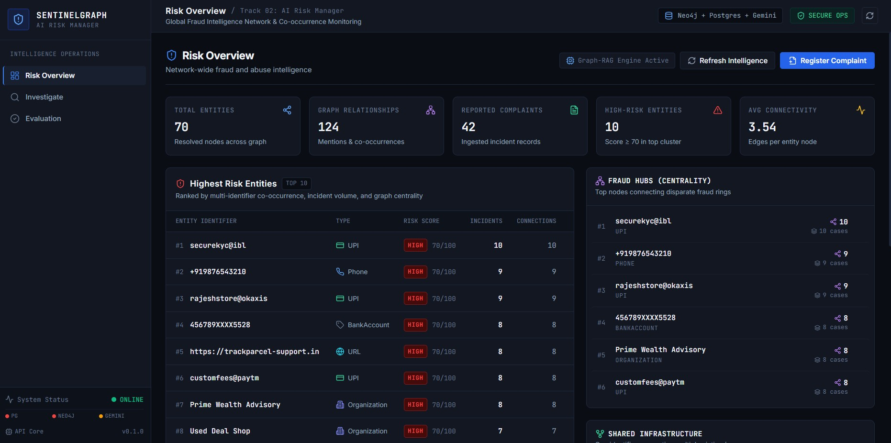
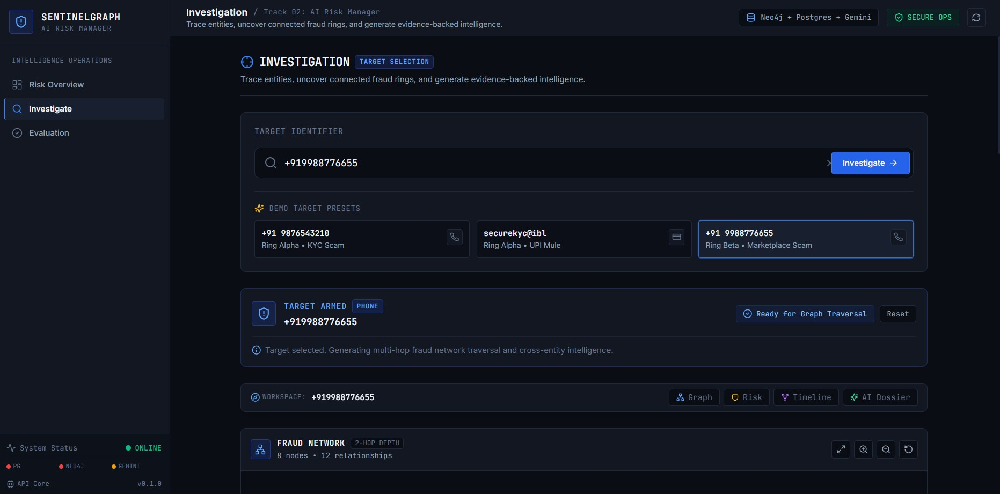
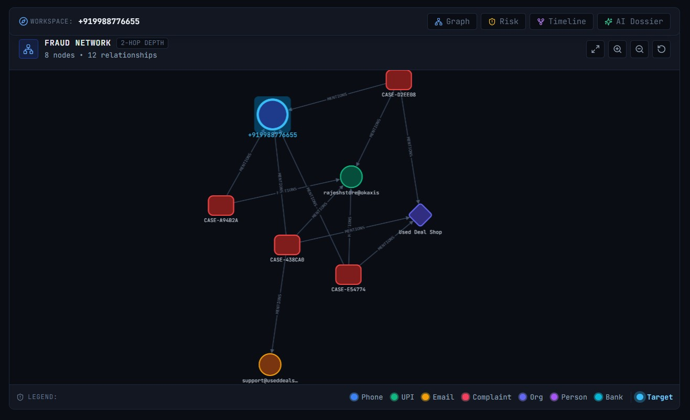
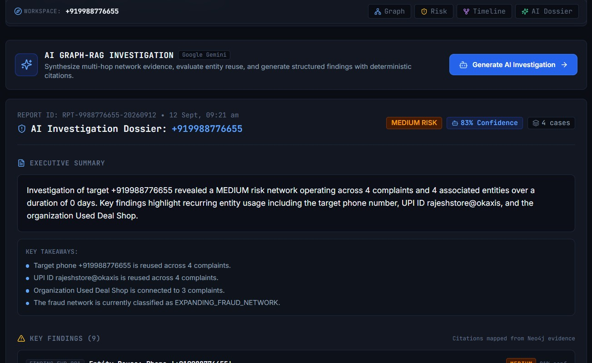

# 🛡️ SentinelGraph AI

<p align="center">
  <h2 align="center">
    Enterprise AI-Powered Cyber Fraud Intelligence Platform
  </h2>
  <p align="center">
    <strong>Defeating Digital Arrest Coercion, UPI Payment Phishing & Mule Syndicates using Graph-RAG</strong>
  </p>
  <p align="center">
    <em>Track 02: AI Risk Manager — AI for Digital Public Safety</em>
  </p>
</p>

<p align="center">
  
  
  
  
  
  
  
  
  
  
</p>

---

## 📌 1. Project Overview & Problem Space

Organized cybercrime syndicates are waging systematic fraud campaigns against citizens, businesses, and public institutions. Schemes like **Digital Arrest coercion**, **UPI payment redirection**, **phishing portals**, and **mule banking rings** exploit fragmented law enforcement data:
* **The Fragmented Data Problem**: Citizen and institutional fraud complaints are typically stored in isolated ticketing queues. A single criminal mobile number or UPI VPA operating across multiple police jurisdictions often goes unnoticed for months.
* **The "Black-Box" AI Problem**: Applying unconstrained generative AI directly to crime data creates catastrophic risks: hallucinated links, invented legal references, non-reproducible risk scores, and speculation that cannot hold up in court.

### The SentinelGraph AI Solution
**SentinelGraph AI** bridges this critical gap. It ingests unstructured fraud complaints, durably records them in **PostgreSQL 16**, extracts verified fraud identifiers using **Google Gemini**, builds an interconnected **Neo4j** knowledge graph, and evaluates crime networks using **100% deterministic Python reasoning engines**. 

Generative AI is strictly constrained to structured extraction and formal report drafting—ensuring that every link, timeline event, and recommendation in the final dossier is grounded in verifiable mathematical facts.

---

## 🏗️ 2. High-Level Architecture & Flow

```
   Citizen / Bank / Cyber Cell Complaint
                    │
                    ▼
   ┌────────────────────────────────────────────────────────┐
   │             Nginx Reverse Proxy (:80)                  │
   │  Routes SPA, /api/, /health, and /metrics to backend   │
   └────────────────────────┬───────────────────────────────┘
                            │
                            ▼
   ┌────────────────────────────────────────────────────────┐
   │             FastAPI Asynchronous Backend (:8000)       │
   │  • RequestLoggingMiddleware (X-Request-ID Tracking)    │
   │  • Pydantic V2 Input Sanitization & Validation         │
   │  • Prometheus Metrics Exposition (/metrics)            │
   └──────────────┬──────────────────────────┬──────────────┘
                  │                          │
                  ▼ (1) ACID Commit          ▼ (2) Async Extraction
   ┌───────────────────────────┐  ┌─────────────────────────┐
   │ PostgreSQL 16             │  │ Google Gemini API       │
   │ Transactional Record Store│  │ Structured Entity Extr. │
   │ • incidents Table         │  └──────────┬──────────────┘
   │ • Case Reference Unique UQ│             │ Extracted Entities
   │ • Check Constraints       │             ▼
   └───────────────────────────┘  ┌─────────────────────────┐
                                  │ Neo4j 5.26 Graph Engine │
                                  │ • 9 Persisted Labels    │
                                  │ • MENTIONS Topology     │
                                  │ • Startup DDL Unique UQ │
                                  └──────────┬──────────────┘
                                             │ Topological Subgraph
                                             ▼
                                  ┌─────────────────────────┐
                                  │ Deterministic Python    │
                                  │ XAI Intelligence Engines│
                                  │ • TimelineReconstruct   │
                                  │ • EntityEvolution       │
                                  │ • EvidenceEngine (0-1)  │
                                  │ • FraudRing Expansion   │
                                  └──────────┬──────────────┘
                                             │ Canonical Case File
                                             ▼
                                  ┌─────────────────────────┐
                                  │ Google Gemini Formatter │
                                  │ • SHA-256 Prompt Hash   │
                                  │ • Citation Preservation │
                                  └──────────┬──────────────┘
                                             │
                                             ▼
                                  ┌─────────────────────────┐
                                  │ React 18 Web Console    │
                                  │ • Cytoscape.js Network  │
                                  │ • Timeline & Dossier    │
                                  │ • AI Governance Console │
                                  └─────────────────────────┘
```

---

## ⚡ 3. Architectural Truths & Invariants

SentinelGraph AI adheres to explicit engineering invariants:
1. **PostgreSQL 16 is the Transactional System of Record**:
   Raw complaints, case reference numbers, reporter details, and triage states are durably committed to PostgreSQL before any AI extraction or graph persistence occurs.
2. **Neo4j Persists a Strict Bipartite Star Topology**:
   The graph persists **only** one relationship type: `(:Complaint)-[:MENTIONS]->(:Entity)`. Conceptual relationships (`REPORTED_IN`, `TRANSFERRED_TO`, `ASSOCIATED_WITH`) are **never** persisted in the database; they are dynamically derived via deterministic graph traversals.
3. **100% Deterministic Investigation Reasoning**:
   Risk scoring, timeline ordering, velocity calculation, network clustering, and evidence scoring are executed by pure Python logic. Gemini never calculates risk scores or determines guilt.
4. **Gemini NEVER Directly Queries Databases**:
   Google Gemini has zero direct connection privileges to PostgreSQL or Neo4j. It receives pre-computed, verified Pydantic view models and emits structured JSON.
5. **Decoupled Failure Isolation**:
   External AI rate-limiting or Neo4j connectivity blips never compromise the primary PostgreSQL complaint record.
6. **Authentication Reality**:
   Authentication is **NOT implemented** in this release. `/api/v1/auth/` is an explicit `"Coming soon"` placeholder. Triage and report generation endpoints are open for local research and hackathon evaluation.
7. **CI Pipeline Scope**:
   Continuous integration currently verifies the backend (Ruff linting, dry-run Alembic migrations, and 287 pytest tests); frontend CI is slated for Horizon 2 hardening.

---

## 💻 4. The React 18 Analyst Console

The web application ([`frontend/`](file:///c:/Devesh/DeveshChauhan/Devesh%20Chauhan/sentinelgraph-ai/frontend)) provides a modern, single-pane triage console:

* 📊 **Risk Overview (`#risk-overview`)**: Global fraud KPIs, highest degree-centrality entity hubs, multi-complaint shared infrastructure tables, and real-time complaint streams.
* 🎯 **Investigation Workspace (`#investigate`)**:
  * **Cytoscape.js Topological Graph**: 1–5 hop traversal depth controls, switchable physics layouts (`cose`, `concentric`, `breadthfirst`, `grid`), pan/zoom controls, and slide-over entity inspection.
  * **Reconstructed Timeline**: Chronological event sequence tracking first-seen dates, identifier reuse, and activity bursts.
  * **AI Investigation Dossier**: Structured findings with verified evidence citations, risk justifications, and actionable containment recommendations.
* 🛡️ **AI Governance & Guardrails Console (`#evaluation`)**: Interactive transparency dashboard detailing the 3-Layer Guardrail Architecture, 5 Golden Scenario benchmark specifications, quality dimension formulas, and live Prometheus telemetry.

---

## 🛠️ 5. Technology Stack

| Layer | Technology | Purpose |
| :--- | :--- | :--- |
| **Frontend UI** | React 18.3, TypeScript 5.7, Vite 6.1 | High-performance Single Page Application (SPA). |
| **Styling & Icons** | Tailwind CSS 3.4, Lucide React | Modern dark-mode analyst UI design system. |
| **Graph Canvas** | Cytoscape.js 3.30 | Interactive Canvas/WebGL topological network visualization. |
| **Ingress & Proxy**| Nginx 1.27 Alpine | Unified static host, Gzip compression, edge security headers. |
| **Backend API** | FastAPI, Python 3.13, Uvicorn | Asynchronous high-throughput REST API. |
| **Relational Store**| PostgreSQL 16 (SQLAlchemy + asyncpg)| ACID transactional system of record with 2 Alembic migrations. |
| **Graph Store** | Neo4j 5.26 Community / AuraDB | Labeled property graph with 9 startup DDL unique constraints. |
| **Generative AI** | Google Gemini (google-genai SDK) | Structured entity extraction and citation-preserving report writer. |
| **Observability** | Prometheus 2.53 & Grafana 11.1 | 15s metric scraping, 5 alert rules, pre-provisioned dashboard. |
| **Containerization**| Docker & Docker Compose | Multi-stage production containers with non-root execution. |

---

## 🚀 6. Quickstart & Deployment

### Option A: Unified Full-Stack Docker Compose (Recommended)
Run the entire platform (Frontend on Nginx, FastAPI Backend, PostgreSQL 16, Neo4j 5.26, Prometheus, and Grafana) with a single command:

```bash
# 1. Clone repository
git clone https://github.com/DeveshChauhan-afk/SentinelGraph-AI.git
cd SentinelGraph-AI

# 2. Configure environment credentials
cp backend/.env.example backend/.env
# Edit backend/.env to provide your Google Gemini API key:
# GEMINI_API_KEY=AIzaSy...

# 3. Build and start all 6 services
docker compose up -d --build
```

#### Operational Endpoints:
* **Analyst Web Console**: `http://localhost` (Port 80)
* **Investigation Workspace**: `http://localhost/#investigate`
* **AI Governance Console**: `http://localhost/#evaluation`
* **FastAPI Backend Swagger**: `http://localhost:8000/docs`
* **Prometheus Metrics**: `http://localhost:8000/metrics` (or `http://localhost:9090`)
* **Grafana Dashboards**: `http://localhost:3000` (Default login: `admin` / `admin`)

---

### Option B: Local Python Development

#### 1. Backend Setup
```bash
cd backend
python -m venv venv
# Windows: venv\Scripts\activate | Linux/macOS: source venv/bin/activate
pip install -r requirements-dev.txt

cp .env.example .env
# Edit .env with your PostgreSQL, Neo4j, and Gemini credentials

# Run database migrations
alembic upgrade head

# Start API server
uvicorn app.main:app --reload --host 0.0.0.0 --port 8000
```

#### 2. Frontend Setup
```bash
cd frontend
npm install
npm run dev
```
Access the local frontend development server at `http://localhost:5173`.

---

## 📡 7. API Reference Overview

All backend endpoints are documented interactively at `http://localhost:8000/docs`:

| Method | Endpoint Path | Description | Response Model |
| :--- | :--- | :--- | :--- |
| `GET` | `/health/live` | Process liveness probe (HTTP 200) | `LivenessResponse` |
| `GET` | `/health/ready`| Dependency readiness probe (Postgres, Neo4j) | `ReadinessResponse` |
| `GET` | `/health` | Detailed operational health diagnostics | `HealthSummaryResponse` |
| `GET` | `/metrics` | Prometheus metrics exposition | Text/Plain |
| `GET` | `/api/v1/version/`| Application version (`1.0.0`) | `{"version": "1.0.0"}` |
| `GET` | `/api/v1/auth/` | Authentication placeholder | `{"message": "Coming soon"}` |
| `POST`| `/api/v1/complaints/` | Register new complaint & trigger extraction | `IncidentResponse` |
| `GET` | `/api/v1/complaints/` | List complaints (paginated) | `list[IncidentListResponse]` |
| `GET` | `/api/v1/complaints/{id}` | Retrieve complaint by UUID | `IncidentResponse` |
| `GET` | `/api/v1/graph/entity/{val}` | Get single graph node | `GraphNode` |
| `GET` | `/api/v1/graph/entity/{val}/neighbors` | 1-hop connected neighbors | `GraphNeighborsResponse` |
| `GET` | `/api/v1/graph/entity/{val}/ring` | Multi-hop connected fraud ring component | `FraudRingResponse` |
| `GET` | `/api/v1/graph/visualization/{id}` | Subgraph for Cytoscape.js (depth 1-5) | `GraphResponse` |
| `GET` | `/api/v1/timeline/{val}` | Reconstruct chronological complaint timeline | `TimelineResponse` |
| `POST`| `/api/v1/investigation/report` | Generate certified AI investigation dossier | `ProfessionalInvestigationReport` |

*For complete parameters, schemas, and error codes, refer to [`docs/04_API_REFERENCE.md`](docs/04_API_REFERENCE.md).*

---

## 📸 8. Platform Preview & Screenshots

Explore SentinelGraph AI's production analyst console, demonstrating real-time fraud topology exploration, deterministic explainability, and enterprise AI governance.

### 1. Network-Wide Risk Intelligence & Executive Overview

*Real-time executive dashboard featuring network-level KPIs, high-risk entity rankings, fraud typology breakdowns, and top cross-incident nexus hubs.*

### 2. Deep Investigation Workspace & Target Triage

*Forensic investigation workspace allowing analysts to search seed identifiers (Phone, UPI, Bank Account), review linked complaints, and launch automated dossier synthesis.*

### 3. Interactive Fraud Topology & Multi-Hop Graph Traversal

*Cytoscape.js topological graph canvas supporting dynamic 1-to-5 hop depth exploration, semantic node styling (Phone, Bank, UPI, Complaint), and physics-driven cluster layouts.*

### 4. Certified AI Investigation Dossier & Explainability

*Evidence-grounded case file synthesized by Google Gemini 2.5 Flash from deterministic graph analytics, complete with severity badges, confidence metrics, and verifiable citations.*

### 5. AI Governance, Guardrails & Model Telemetry

*Three-layer governance auditor console validating schema compliance, citation fidelity, hallucination mitigation, and real-time Prometheus telemetry.*

---

## 📚 9. Comprehensive Documentation Map

Deep-dive architectural, database, and operational manuals are available in the [`docs/`](docs/) directory:

| Document | Focus & Highlights |
| :--- | :--- |
| **[`docs/01_OVERVIEW.md`](docs/01_OVERVIEW.md)** | System overview, digital arrest & UPI problem space, and foundational design principles. |
| **[`docs/02_ARCHITECTURE.md`](docs/02_ARCHITECTURE.md)** | Full-stack request lifecycle, sequence diagrams, service interactions, and data boundaries. |
| **[`docs/03_DATABASE.md`](docs/03_DATABASE.md)** | Dual-database design, 2 Alembic revisions, 9 Neo4j labels, startup unique DDL, and MENTIONS topology. |
| **[`docs/04_API_REFERENCE.md`](docs/04_API_REFERENCE.md)** | Complete mounted route catalog, parameters, response models, health probes, and auth placeholder. |
| **[`docs/05_AI_PIPELINE.md`](docs/05_AI_PIPELINE.md)** | Deterministic investigation architecture, Graph-RAG flow, Gemini boundaries, prompt hashing, timeouts/retries. |
| **[`docs/06_EVALUATION_GOVERNANCE.md`](docs/06_EVALUATION_GOVERNANCE.md)**| 3-layer guardrail pipeline, 5 golden scenarios, quality evaluator, and distinguishing offline harness from UI. |
| **[`docs/07_FRONTEND.md`](docs/07_FRONTEND.md)** | React 18, TypeScript, Vite, Tailwind, Cytoscape.js integration, hash routing, and Nginx proxy. |
| **[`docs/08_OBSERVABILITY.md`](docs/08_OBSERVABILITY.md)** | Prometheus metrics catalog, 15s scrape interval, 5 alert rules, Grafana dashboard, and health probes. |
| **[`docs/09_DEPLOYMENT_OPERATIONS.md`](docs/09_DEPLOYMENT_OPERATIONS.md)**| Root Docker Compose, backend-only compose, migration lifecycle, ports, and operational runbooks. |
| **[`docs/10_SECURITY.md`](docs/10_SECURITY.md)** | Unauthenticated reality disclosure, Pydantic validation, SecretStr protection, and hardening roadmap. |
| **[`docs/11_CHANGELOG.md`](docs/11_CHANGELOG.md)** | Verified historical engineering record through Sprint 12 and full-stack frontend completion. |
| **[`docs/12_ROADMAP.md`](docs/12_ROADMAP.md)** | Strategic product roadmap separating Implemented v1, Near-Term Hardening, and Future V2+ capabilities. |

---

## 🔒 10. Security Reality & Current Limitations

1. **Unauthenticated Triage APIs**: User authentication is not implemented in v1; endpoints are accessible without tokens.
2. **Offline Evaluation Harness**: The evaluation package (`app/evaluation/`) is an offline test and benchmark suite executed via pytest, not a public REST API.
3. **Continuous Integration**: GitHub Actions CI currently validates backend code (Ruff, dry-run Alembic migrations, pytest); frontend lint/test automation is planned for Horizon 2.
4. **SinglePersisted Topology**: Neo4j persists only `MENTIONS` edges; high-level associations are computed dynamically in Python.

---

## 🗺️ 11. Future Roadmap Horizons (V2+)

* 🎙️ **Multimodal Voice Scam Audio Analysis**: Audio transcription and synthetic voice clone matching for digital arrest calls.
* 🖼️ **Counterfeit Document OCR**: Multimodal detection of forged arrest warrants, fake CBI notices, and cloned police identity cards.
* 🌐 **Multilingual Indian Language Support**: Extraction fine-tuned for Hindi, Tamil, Telugu, Bengali, Marathi, and Gujarati complaint narratives.
* ⚡ **Direct Banking Switch Freeze Connectors**: Real-time webhooks connecting recommendations directly to NPCI and commercial banking switches.
* 🏛️ **National Portal Adapters**: Real-time ingestion connectors for the Indian National Cyber Crime Reporting Portal (NCRP).

---

## 📄 License & Acknowledgements

* **License**: Open-source under the [MIT License](LICENSE).
* **Acknowledgements**: Built with FastAPI, PostgreSQL, Neo4j Community, Google Gemini, React, Cytoscape.js, Prometheus, and Grafana.
