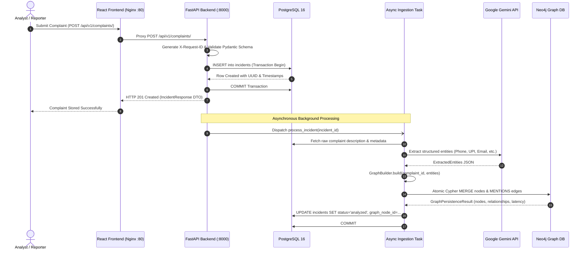
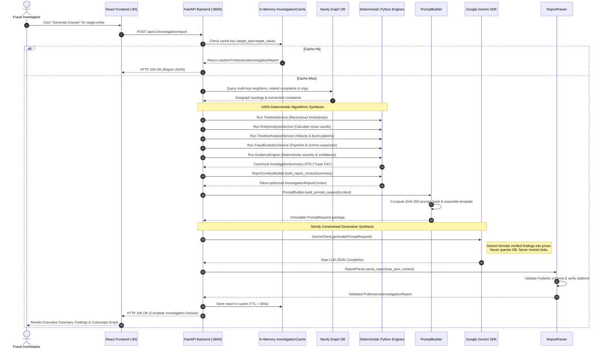

# 🏗️ SentinelGraph AI: Full-Stack System Architecture

## 1. End-to-End Architectural Overview

SentinelGraph AI is structured as a layered, asynchronous full-stack platform designed to process high-throughput fraud complaints, maintain topological intelligence over interconnected fraud networks, and synthesize verifiable investigation dossiers.


*High-Level Architecture (HLD) diagram illustrating client ingress, API gateway routing, dual-store persistence (PostgreSQL & Neo4j), deterministic explainability services, and Gemini LLM orchestration.*

The platform architecture spans seven distinct execution layers:

```
                                  USER INTERFACE LAYER
               ┌─────────────────────────────────────────────────────────┐
               │    React 18 + TypeScript + Vite + Tailwind CSS SPA      │
               │  [Risk Overview]   [Investigate Workspace]  [Governance]│
               └────────────────────────────┬────────────────────────────┘
                                            │ HTTP (Port 80)
                                            ▼
                                  INGRESS & REVERSE PROXY
               ┌─────────────────────────────────────────────────────────┐
               │                 Nginx 1.27 Alpine                       │
               │  • Serves static assets with immutable cache headers    │
               │  • Reverse proxies /api/, /health, /metrics to backend  │
               │  • Enforces Gzip compression and baseline security headers│
               └────────────────────────────┬────────────────────────────┘
                                            │ HTTP (Port 8000)
                                            ▼
                                   API & MIDDLEWARE LAYER
               ┌─────────────────────────────────────────────────────────┐
               │                    FastAPI Core                         │
               │  • RequestLoggingMiddleware (X-Request-ID correlation)  │
               │  • CORS Middleware (Configured origin whitelisting)     │
               │  • Global Exception Handler & Structured Pydantic V2    │
               └──────┬─────────────────────┬─────────────────────┬──────┘
                      │                     │                     │
                      ▼                     ▼                     ▼
               COMPLAINTS API       INVESTIGATION API         GRAPH API
               [/api/v1/complaints] [/api/v1/investigation]   [/api/v1/graph]
                      │                     │                     │
                      ▼                     ▼                     ▼
          ┌───────────────────────┐ ┌───────────────────┐ ┌───────────────┐
          │    IncidentService    │ │InvestigationReport│ │GraphQuery     │
          │                       │ │Service            │ │Service        │
          └───────────┬───────────┘ └─────────┬─────────┘ └───────┬───────┘
                      │                       │                   │
                      │                       ▼                   │
                      │             DETERMINISTIC XAI ENGINES     │
                      │             ┌───────────────────────────┐ │
                      │             │ • TimelineService         │ │
                      │             │ • EntityAnalysisService   │ │
                      │             │ • TimelineAnalysisService │ │
                      │             │ • FraudEvolutionService   │ │
                      │             │ • EvidenceEngine          │ │
                      │             │ • InvestigationSummarySvc │ │
                      │             │ • ReportContextBuilder    │ │
                      │             └─────────────┬─────────────┘ │
                      │                           │               │
                      ▼                           ▼               ▼
          ┌───────────────────────┐ ┌───────────────────┐ ┌───────────────┐
          │  PostgreSQL 16        │ │  PromptBuilder    │ │ Neo4j 5.26    │
          │  (System of Record)   │ │  (SHA-256 Hash)   │ │ (AuraDB /     │
          │  • ACID Transactions  │ └─────────┬─────────┘ │  Community)   │
          │  • incidents Table    │           │           │ • 9 Labels    │
          │  • Case Reference UQ  │           ▼           │ • MENTIONS    │
          │  • Check Constraints  │ ┌───────────────────┐ │   only        │
          └───────────────────────┘ │ GeminiClient      │ │ • Cypher      │
                                    │ (google-genai SDK)│ │   MERGE       │
                                    │ • Bounded Retry   │ └───────────────┘
                                    │ • Timeout Guard   │
                                    └─────────┬─────────┘
                                              │
                                              ▼
                                    ┌───────────────────┐
                                    │   ReportParser    │
                                    │   (Pydantic V2)   │
                                    └───────────────────┘
```

---

## 2. End-to-End Request & Data Flow

### 2.1 Complaint Ingestion & Graph Construction Flow

When a complaint is reported via the API or frontend web console, the system executes an atomic relational commit followed by an asynchronous, decoupled entity extraction and graph persistence workflow:



#### Decoupled Error Isolation Invariant
If Google Gemini encounters a transient outage or Neo4j connectivity fails during background processing:
* The PostgreSQL transaction for the complaint **remains intact and committed**.
* The complaint record status remains in its current state (`new` or `processing`) for subsequent retry.
* The citizen's complaint is never dropped or lost due to downstream AI or graph failure.

---

### 2.2 Graph-RAG Investigation & Report Generation Flow

When an investigator queries an entity (phone, UPI, complaint ID) for triage or formal report generation, the system executes a deterministic Graph-RAG pipeline:



---

## 3. Layered Architectural Subsystems

### 3.1 Ingress & Static Delivery Layer (Nginx)
The frontend web application is packaged as a high-performance static build served by Nginx Alpine in a dedicated container on port 80:
* **Single-Origin Reverse Proxy**:
  * Requests matching `/api/` are forwarded directly to `http://api:8000/`.
  * Requests matching `/health` are forwarded to `http://api:8000/health`.
  * Requests matching `/metrics` are forwarded to `http://api:8000/metrics`.
  * All other paths fall back to `/index.html` (`try_files $uri $uri/ /index.html`) to support client-side Single Page Application (SPA) hash routing.
* **Asset Optimization**: High-efficiency Gzip compression enabled for HTML, CSS, JavaScript, and JSON payloads. Immutable caching (`max-age=31536000`) applied to Vite hashed assets.
* **Security Headers**: Baseline headers injected at the ingress edge:
  * `X-Frame-Options: SAMEORIGIN`
  * `X-Content-Type-Options: nosniff`
  * `X-XSS-Protection: 1; mode=block`
  * `Referrer-Policy: strict-origin-when-cross-origin`

---

### 3.2 Application Core & Middleware Layer (FastAPI)
The backend application lifecycle is managed in [`app/main.py`](file:///c:/Devesh/DeveshChauhan/Devesh%20Chauhan/sentinelgraph-ai/backend/app/main.py) and [`app/core/events.py`](file:///c:/Devesh/DeveshChauhan/Devesh%20Chauhan/sentinelgraph-ai/backend/app/core/events.py):
1. **Startup Lifecycle**:
   * Initializes Loguru structured logging configuration.
   * Verifies Neo4j connectivity via `connect_neo4j()`.
   * Executes programmatic DDL schema constraints via `init_neo4j_schema()`.
2. **Shutdown Lifecycle**:
   * Gracefully terminates the Neo4j async connection pool.
   * Closes the SQLAlchemy async engine and connection pool.
3. **Middleware Pipeline**:
   * **`RequestLoggingMiddleware`**: Extracts incoming `X-Request-ID` or generates a fresh `uuid4`. Binds the correlation ID to Python `ContextVar` and Loguru contextual logger. Records HTTP method, path, status code, and latency in milliseconds. Injects `X-Request-ID` into the response header.
   * **`CORSMiddleware`**: Controls cross-origin requests based on `settings.CORS_ORIGINS`.
   * **`GlobalExceptionHandler`**: Catches unhandled exceptions, logs full tracebacks with correlation IDs, and emits standardized RFC 7807 JSON error envelopes to prevent internal stack leakages.

---

### 3.3 Domain Services & Deterministic Analysis Layer
Business logic is strictly decoupled into dedicated service classes:

| Service Name | Module Location | Architectural Responsibility |
| :--- | :--- | :--- |
| **`IncidentService`** | `app.services.incident_service` | Manages PostgreSQL transactional boundaries (`commit`/`rollback`), complaint creation, filtering, and retrieval. |
| **`IncidentProcessingService`** | `app.services.incident_processing_service` | Coordinates background entity extraction and graph persistence with error isolation. |
| **`GraphQueryService`** | `app.graph.query_service` | Provides read-only topological queries (entity lookup, neighbors, incident associations, fraud ring components, network statistics). |
| **`TimelineService`** | `app.services.timeline_service` | Discovers multi-hop connected complaints and orders them into chronological event timelines. |
| **`EntityAnalysisService`** | `app.services.entity_analysis_service` | Analyzes entity lifecycles, first-seen/last-seen timestamps, and cross-complaint reuse counts. |
| **`TimelineAnalysisService`** | `app.services.timeline_analysis_service` | Evaluates temporal velocity, dormant intervals, and burst activity spikes across the network. |
| **`FraudEvolutionService`** | `app.services.fraud_evolution_service` | Classifies syndicate infrastructure expansion events (payment channel shifts, communication pivots). |
| **`EvidenceEngine`** | `app.services.evidence_engine` | Evaluates deterministic evidence severity (`CRITICAL`, `HIGH`, `MEDIUM`, `LOW`) and mathematical confidence scores (`0.0 <= c <= 1.0`). |
| **`InvestigationSummaryService`** | `app.services.investigation_summary_service` | Assembles all deterministic outputs into an immutable, canonical `InvestigationSummary` ("Case File DTO"). |
| **`ReportContextBuilder`** | `app.services.report_context_builder` | Compiles token-optimized view models ready for prompt formatting. |
| **`PromptBuilder`** | `app.services.prompt_builder` | Combines prompt templates with context and computes deterministic SHA-256 prompt fingerprints (`prompt_hash`). |
| **`InvestigationReportService`**| `app.services.investigation_report_service` | Orchestrates end-to-end report generation pipeline from graph retrieval to validated Pydantic report output. |

---

### 3.4 Persistence Layer (Dual-Database Model)
SentinelGraph AI implements a specialized dual-database persistence tier:
* **PostgreSQL 16 (Relational System of Record)**:
  * Accessed via async SQLAlchemy 2.0 and `asyncpg`.
  * Dedicated connection pool (`DB_POOL_SIZE=10`, `DB_MAX_OVERFLOW=20`).
  * Stores raw complaint narratives, reporter information, case reference IDs, and triage states.
  * Governed by two explicit Alembic migrations (`3d3cf359c2a1` and `e7c2a19d4b8f`).
* **Neo4j 5.26 Community / AuraDB (Property Graph Engine)**:
  * Accessed via the official Neo4j Python Async Driver (`AsyncGraphDatabase`).
  * Enforces a strict bipartite star topology: `(:Complaint)-[:MENTIONS]->(:Entity)`.
  * Executes atomic Cypher `MERGE` transactions to ensure idempotent entity and edge persistence.
  * Programmatically initializes 9 database uniqueness constraints on startup.

---

### 3.5 AI Generation & Guardrail Layer
* **Provider**: Google Gemini (via official `google-genai` SDK).
* **Execution Guardrails**:
  * Calls offloaded to worker threads via `asyncio.to_thread` to prevent event loop starvation.
  * Per-attempt timeout strictly enforced via `asyncio.wait_for(timeout=GEMINI_TIMEOUT_SECONDS)`.
  * Bounded exponential backoff retry policy on transient status codes (HTTP 429, 500, 502, 503, 504).
  * Non-retryable immediate abort on timeouts, auth errors, or client invalid syntax (HTTP 400, 401, 403, 404).
* **Output Grounding**:
  * Model responses are strictly constrained to JSON schemas adhering to `ProfessionalInvestigationReport`.
  * Citations are verified against the deterministic context to eliminate ungrounded claims.

---

### 3.6 Observability & Telemetry Layer
* **Prometheus Client**: Embedded in the FastAPI application, observing HTTP request counts, latency histograms, LLM request counts, LLM execution durations, and prompt/completion token counters.
* **Exposition**: Standard Prometheus text format exposed at `GET /metrics`.
* **Health Probes**: Modular health checks testing PostgreSQL, Neo4j, and Gemini at `/health`, `/health/live`, and `/health/ready`.
* **Alerting & Dashboards**: Five production Alertmanager rules defined in `monitoring/prometheus/alerts.yml` and pre-provisioned Grafana operational dashboards in `monitoring/grafana/`.
