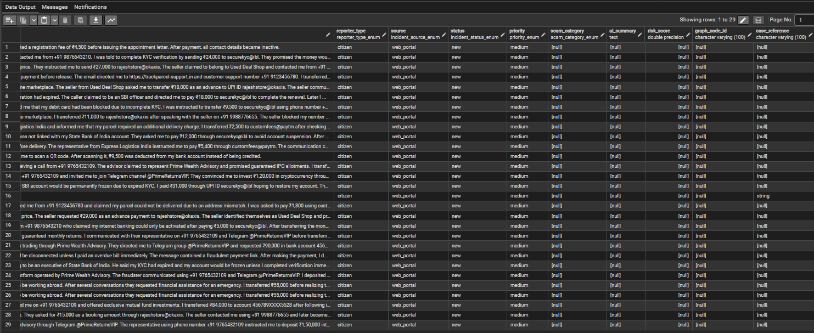
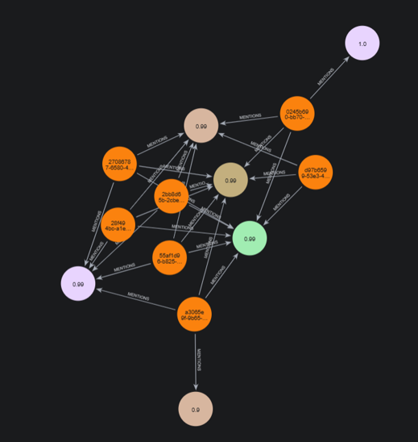

# 🗄️ SentinelGraph AI: Dual-Database Architecture & Data Models

## 1. Architectural Division of Responsibilities

SentinelGraph AI implements a specialized **Hybrid Dual-Database Architecture** combining an ACID relational database (**PostgreSQL 16**) and a labeled property graph database (**Neo4j 5.26 Community / AuraDB**). Each database fulfills a strictly partitioned responsibility:

```
┌────────────────────────────────────────────────────────┐
│               PostgreSQL 16 (Relational)               │
│  - Authoritative Transactional System of Record        │
│  - Raw Complaint Narratives, Reporter Identity, Triage │
│  - External Legal Case References (FIR / Police IDs)   │
│  - Check Constraints & State History Auditing          │
└──────────────────────────┬─────────────────────────────┘
                           │ (1) Transaction Committed
                           │ (2) Asynchronous AI Entity Extraction
                           │ (3) Idempotent Cypher MERGE
                           ▼
┌────────────────────────────────────────────────────────┐
│               Neo4j 5.26 (Property Graph)              │
│  - Connected Fraud Network Topology & Link Analysis    │
│  - Bipartite / Star Graph: (:Complaint)-[:MENTIONS]->  │
│  - 9 Persisted Node Labels with Startup Unique DDL     │
│  - Multi-Hop Graph Traversal & Fraud Ring Components   │
└────────────────────────────────────────────────────────┘
```

### Architectural Comparison Matrix

| Dimension | PostgreSQL 16 (Relational) | Neo4j 5.26 (Property Graph) |
| :--- | :--- | :--- |
| **Primary Role** | Authoritative System of Record & Audit Store | Fraud Network Topology & Link Intelligence |
| **Data Scope** | Unstructured narrative text, legal references, triage states | Extracted entities, network linkages, and graph clusters |
| **Data Model** | Relational tables, typed columns, check constraints, ENUMs | Labeled Property Graph (`(:Complaint)-[:MENTIONS]->(:Entity)`) |
| **Persisted Topology** | Flat relational schema (`incidents` table) | Bipartite star graph (`MENTIONS` relationship type only) |
| **Access Patterns** | Primary key lookups, paginated filtering, text queries | Multi-hop traversals, shortest path, connected components |
| **Driver / Interface** | Async SQLAlchemy 2.0 with `asyncpg` (`postgresql+asyncpg://`) | Neo4j Python Async Driver (`AsyncGraphDatabase`) |
| **Schema Governance** | Explicit migration scripts managed via Alembic | Startup DDL uniqueness constraints + application Pydantic schemas |
| **Consistency Scope** | ACID transactions with service-managed commit/rollback | Idempotent Cypher `MERGE` inside atomic write transactions |
| **AI LLM Access** | **Strictly Forbidden** (No direct LLM queries) | **Strictly Forbidden** (No direct LLM queries) |

---

## 2. PostgreSQL Relational System of Record

### 2.1 Database Engine & Async Connection Pooling
* **Engine**: PostgreSQL 16+ running in Docker or cloud-managed PostgreSQL (e.g. Supabase, Render, AWS RDS).
* **Async Driver**: SQLAlchemy 2.0 async engine using `asyncpg` (`postgresql+asyncpg://`).
* **Session Lifecycle**: Instantiated via `async_sessionmaker` in [`app/db/database.py`](file:///c:/Devesh/DeveshChauhan/Devesh%20Chauhan/sentinelgraph-ai/backend/app/db/database.py) with `expire_on_commit=False` and `autoflush=False`.
* **FastAPI Request Scope**: The `get_db()` dependency yields an isolated `AsyncSession` per HTTP request, guaranteeing that open transactions are closed or rolled back upon request termination.

#### Connection Pool Settings
Loaded from [`app/core/config.py`](file:///c:/Devesh/DeveshChauhan/Devesh%20Chauhan/sentinelgraph-ai/backend/app/core/config.py):
* `DB_POOL_SIZE`: `10` persistent connections.
* `DB_MAX_OVERFLOW`: `20` burst connections.
* `DB_POOL_TIMEOUT`: `30` seconds checkout timeout.
* `DB_POOL_RECYCLE`: `1800` seconds (30 minutes) recycling interval to eliminate stale TCP sockets.
* `pool_pre_ping`: `True` (emits a lightweight `SELECT 1` ping prior to checkout).
* `pool_reset_on_return`: `"rollback"` (guarantees no uncommitted transaction leaks back to the pool).

---

### 2.2 PostgreSQL Schema: The `incidents` Table
The `incidents` table (mapped to the [`Incident`](file:///c:/Devesh/DeveshChauhan/Devesh%20Chauhan/sentinelgraph-ai/backend/app/models/incident.py) ORM model) is the single concrete relational table in the database:


*PostgreSQL relational database table viewing complaint records, lifecycle statuses, priority levels, risk scores, case references, and audit timestamps.*

| Column Name | SQL Type | Python / Model Type | Nullable | Constraints & Defaults | Description |
| :--- | :--- | :--- | :--- | :--- | :--- |
| `id` | `UUID` | `uuid.UUID` | No | Primary Key (`pk_incidents`) | Unique incident UUID identifier |
| `title` | `VARCHAR(255)` | `str` | No | &mdash; | Short summary/subject of the fraud report |
| `description` | `TEXT` | `str` | No | &mdash; | Unstructured citizen/reporter narrative |
| `reporter_type` | `ENUM` | `ReporterType` | No | `reporter_type_enum` | Reporter origin category |
| `source` | `ENUM` | `IncidentSource` | No | `incident_source_enum` | Ingestion channel |
| `status` | `ENUM` | `IncidentStatus` | No | `incident_status_enum`, default: `'new'` | Current complaint lifecycle stage |
| `priority` | `ENUM` | `Priority` | No | `priority_enum`, default: `'medium'` | Operational triage priority |
| `scam_category` | `ENUM` | `ScamCategory` | Yes | `scam_category_enum` | Categorized fraud scheme |
| `ai_summary` | `TEXT` | `str \| None` | Yes | Comment: `"AI-generated fraud summary"` | Synthesized plain-text summary |
| `risk_score` | `FLOAT` | `float \| None` | Yes | Check: `0.0 <= risk_score <= 1.0` | Scalar fraud risk score |
| `graph_node_id` | `VARCHAR(100)`| `str \| None` | Yes | Indexed (`ix_incidents_graph_node_id`) | Neo4j cross-reference (`complaint:<uuid>`) |
| `case_reference`| `VARCHAR(100)`| `str \| None` | Yes | Unique (`uq_incidents_case_reference`) | External legal ID (e.g., FIR, Bank Dispute) |
| `created_at` | `TIMESTAMPTZ` | `datetime` | No | Server default: `now()` | UTC creation timestamp (timezone-aware) |
| `updated_at` | `TIMESTAMPTZ` | `datetime` | No | Server default: `now()`, onupdate: `now()` | UTC last modified timestamp (timezone-aware)|

---

### 2.3 PostgreSQL ENUM Types & Domain Values

The schema defines five dedicated PostgreSQL ENUM types:

```sql
-- Reporter classification
CREATE TYPE reporter_type_enum AS ENUM (
    'citizen', 'police', 'bank', 'cyber_cell', 'other'
);

-- Ingestion channel
CREATE TYPE incident_source_enum AS ENUM (
    'web_portal', 'mobile_app', 'api', 'bulk_import'
);

-- Incident lifecycle
CREATE TYPE incident_status_enum AS ENUM (
    'new', 'processing', 'analyzed', 'under_investigation', 'resolved', 'closed'
);

-- Operational priority
CREATE TYPE priority_enum AS ENUM (
    'low', 'medium', 'high', 'critical'
);

-- Fraud classification
CREATE TYPE scam_category_enum AS ENUM (
    'digital_arrest', 'upi_fraud', 'phishing', 'qr_scam', 
    'identity_theft', 'investment_fraud', 'other', 'unknown'
);
```

---

### 2.4 Constraints, Indexes & Naming Conventions

* **Primary Key**: `pk_incidents` on `id` (`UUID`).
* **Unique Constraints**:
  * `uq_incidents_case_reference` on `case_reference`: Enforces uniqueness for external case identifiers (e.g. Police FIR numbers, Bank Complaint IDs). Created in migration revision `e7c2a19d4b8f`.
* **Check Constraints**:
  * `ck_incidents_check_risk_score_range`: Enforces `risk_score >= 0 AND risk_score <= 1`.
* **Explicit B-Tree Indexes**:
  * `idx_incident_status` on `(status)`: Optimizes queue filtering and triage state retrieval.
  * `idx_incident_priority` on `(priority)`: Optimizes priority-ranked incident queue lookups.
  * `idx_incident_created` on `(created_at)`: Accelerates chronological queries, pagination, and timeline ordering.
  * `ix_incidents_graph_node_id` on `(graph_node_id)`: Enables bidirectional lookup between Neo4j node references and relational incident records.
* **SQLAlchemy Naming Conventions**:
  All constraints and indexes use deterministic naming patterns configured on `Base.metadata`:
  ```python
  convention = {
      "ix": "ix_%(column_0_label)s",
      "uq": "uq_%(table_name)s_%(column_0_name)s",
      "ck": "ck_%(table_name)s_%(constraint_name)s",
      "fk": "fk_%(table_name)s_%(column_0_name)s_%(referred_table_name)s",
      "pk": "pk_%(table_name)s",
  }
  ```

---

### 2.5 Alembic Migration History

Relational database migrations are version-controlled under [`backend/alembic/versions/`](file:///c:/Devesh/DeveshChauhan/Devesh%20Chauhan/sentinelgraph-ai/backend/alembic/versions). The database has two official migration revisions:

#### Revision 1: `3d3cf359c2a1` (Base Migration)
* **File**: `3d3cf359c2a1_create_incidents_table.py`
* **Date**: 2026-07-07
* **Operations**:
  * Creates all 5 PostgreSQL ENUM types (`reporter_type_enum`, `incident_source_enum`, `incident_status_enum`, `priority_enum`, `scam_category_enum`).
  * Creates the `incidents` table with all base columns, `UUID` primary key, and check constraint `ck_incidents_check_risk_score_range`.
  * Creates B-Tree indexes: `idx_incident_status`, `idx_incident_priority`, `idx_incident_created`, and `ix_incidents_graph_node_id`.

#### Revision 2: `e7c2a19d4b8f` (Case Reference Unique Constraint)
* **File**: `e7c2a19d4b8f_add_case_reference_unique_constraint.py`
* **Revises**: `3d3cf359c2a1`
* **Date**: 2026-08-27
* **Operations**:
  * Adds database-level uniqueness constraint `uq_incidents_case_reference` on `incidents(case_reference)`.
  * Ensures that duplicate complaints with the same FIR or Bank Complaint Reference cannot be ingested into the system.

#### Migration Execution & Dry-Run
```bash
# Apply migrations to head
alembic upgrade head

# Dry-run SQL generation (verified in CI)
alembic upgrade head --sql
```

---

## 3. Neo4j Property Graph Architecture

### 3.1 Graph Domain Model & 9 Node Labels

The Fraud Intelligence Graph persists nodes across 9 distinct labels defined in [`GraphLabel`](file:///c:/Devesh/DeveshChauhan/Devesh%20Chauhan/sentinelgraph-ai/backend/app/graph/models.py) and constructed by [`GraphBuilder`](file:///c:/Devesh/DeveshChauhan/Devesh%20Chauhan/sentinelgraph-ai/backend/app/graph/builder.py):


*Neo4j graph visualization showing star-topology connections between Complaint nodes and extracted entity nodes (Phone, UPI, BankAccount, Person).*

| Node Label | ID Prefix Format | Example ID | Primary Properties |
| :--- | :--- | :--- | :--- |
| **`Complaint`** | `complaint:<uuid>` | `complaint:3d3cf359-0000-...` | `id`, `complaint_id`, `lookup_value`, `created_at` (ISO 8601) |
| **`Phone`** | `phone:<value>` | `phone:+919876543210` | `id`, `value`, `confidence`, `lookup_value` |
| **`UPI`** | `upi:<value>` | `upi:fraudster@okhdfcbank` | `id`, `value`, `confidence`, `lookup_value` |
| **`Email`** | `email:<value>` | `email:support@fake-refund.com` | `id`, `value`, `confidence`, `lookup_value` |
| **`URL`** | `url:<value>` | `url:https://phishing-portal.xyz` | `id`, `value`, `confidence`, `lookup_value` |
| **`BankAccount`** | `bank:<value>` | `bank:987654321098` | `id`, `value`, `confidence`, `lookup_value` |
| **`Organization`**| `org:<value>` | `org:Cyber Crime Branch Police` | `id`, `value`, `confidence`, `lookup_value` |
| **`Person`** | `person:<value>` | `person:Rajesh Sharma` | `id`, `value`, `confidence`, `lookup_value` |
| **`Location`** | `location:<value>` | `location:New Delhi` | `id`, `value`, `confidence`, `lookup_value` |

#### Deterministic Node Identifier Invariant
Every node ID in Neo4j follows the strict format: `<prefix>:<normalized_value>`. When multiple independent complaints mention the identical phone number `+919876543210`, both complaints resolve to the exact same node: `phone:+919876543210`. This deterministic naming is the foundational mechanism that enables instant multi-complaint link discovery.

---

### 3.2 Startup DDL Schema Constraints

Unlike earlier development versions where constraints were not enforced at the database level, SentinelGraph AI executes **9 programmatic database uniqueness constraints** on application startup via [`init_neo4j_schema()`](file:///c:/Devesh/DeveshChauhan/Devesh%20Chauhan/sentinelgraph-ai/backend/app/db/neo4j_schema.py):

```cypher
CREATE CONSTRAINT uq_complaint_id IF NOT EXISTS FOR (n:Complaint) REQUIRE n.id IS UNIQUE;
CREATE CONSTRAINT uq_phone_id IF NOT EXISTS FOR (n:Phone) REQUIRE n.id IS UNIQUE;
CREATE CONSTRAINT uq_upi_id IF NOT EXISTS FOR (n:UPI) REQUIRE n.id IS UNIQUE;
CREATE CONSTRAINT uq_email_id IF NOT EXISTS FOR (n:Email) REQUIRE n.id IS UNIQUE;
CREATE CONSTRAINT uq_url_id IF NOT EXISTS FOR (n:URL) REQUIRE n.id IS UNIQUE;
CREATE CONSTRAINT uq_bank_account_id IF NOT EXISTS FOR (n:BankAccount) REQUIRE n.id IS UNIQUE;
CREATE CONSTRAINT uq_organization_id IF NOT EXISTS FOR (n:Organization) REQUIRE n.id IS UNIQUE;
CREATE CONSTRAINT uq_person_id IF NOT EXISTS FOR (n:Person) REQUIRE n.id IS UNIQUE;
CREATE CONSTRAINT uq_location_id IF NOT EXISTS FOR (n:Location) REQUIRE n.id IS UNIQUE;
```

* All 9 constraints are enforced on the property `n.id IS UNIQUE`.
* The operation is idempotent (`IF NOT EXISTS`) and executes automatically inside `events.py` before traffic is accepted.
* Ensures database-enforced integrity even under concurrent write conditions.

---

### 3.3 The Bipartite / Star Graph Topology (MENTIONS Only)

> [!IMPORTANT]
> **`MENTIONS` is the ONLY relationship type persisted in Neo4j.**

The graph topology connects `Complaint` nodes directly to extracted entity nodes:

```text
(:Complaint)-[:MENTIONS]->(:Entity)
```

```
(c1:Complaint {id: "complaint:111"}) ──[:MENTIONS]──► (e1:Phone {id: "phone:+919876543210"})
                                                               ▲
(c2:Complaint {id: "complaint:222"}) ──[:MENTIONS]────────────┘
```

#### Refuting Conceptual Relationship Myths
Conceptual relationships often discussed in fraud literature (such as `REPORTED_IN`, `TRANSFERRED_TO`, `ASSOCIATED_WITH`, `CO_OCCURS_WITH`, or `OWNED_BY`) are **NOT persisted** in the database. 
* **Shared Entity Detection**: Evaluated dynamically by finding two complaints connected to the same entity:
  `(c1:Complaint)-[:MENTIONS]->(e)<-[:MENTIONS]-(c2:Complaint)`
* **Fraud Ring Discovery**: Discovered by traversing connected paths of arbitrary depth across `MENTIONS` edges:
  `MATCH (entity)-[*0..6]-(connected)`
* **Financial Flow Traces**: Evaluated deterministically in Python using chronological complaint timestamps and reported transaction details.

Persisting only `MENTIONS` keeps graph ingestion lightning fast, avoids schema explosion, and prevents stale edge invalidation when new complaints arrive.

---

### 3.4 Persistence & Idempotency (`MERGE`)

Graph persistence is executed in an atomic transaction via [`GraphRepository.save_graph`](file:///c:/Devesh/DeveshChauhan/Devesh%20Chauhan/sentinelgraph-ai/backend/app/graph/repository.py). The repository uses Cypher `MERGE` statements to guarantee complete write idempotency:

#### Node Merging
```cypher
MERGE (n:<Label> {id: $id})
SET n += $properties
```
* If the node exists, its properties (such as confidence score and latest metadata) are updated without creating duplicates.

#### Relationship Merging
```cypher
MATCH (source:<SourceLabel> {id: $source_id})
MATCH (target:<TargetLabel> {id: $target_id})
MERGE (source)-[r:MENTIONS]->(target)
SET r += $properties
```
* Ensures that re-processing a complaint or extracting the same entity multiple times within a report never creates duplicate edges.

---

## 4. Database Access Boundaries & Security Rules

To prevent data corruption, security breaches, and non-deterministic behavior:

1. **Gemini NEVER Directly Queries PostgreSQL or Neo4j**:
   Google Gemini has zero access to database connections, connection strings, or SQL/Cypher execution capabilities. Gemini is an isolated cognitive worker that receives structured Pydantic DTOs and emits structured JSON.
2. **Service-Owned Transaction Boundaries**:
   Repositories never commit transactions directly. The service layer (`IncidentService`) owns the transaction lifecycle:
   ```python
   try:
       incident = await self._repository.create(incident_data)
       await self._session.commit()
   except Exception:
       await self._session.rollback()
       raise
   ```
3. **Decoupled Relational Commit Before Graph Write**:
   The PostgreSQL incident record is committed **first**. If Neo4j or Gemini fails during background processing, the primary complaint record remains safe and durable in PostgreSQL.
