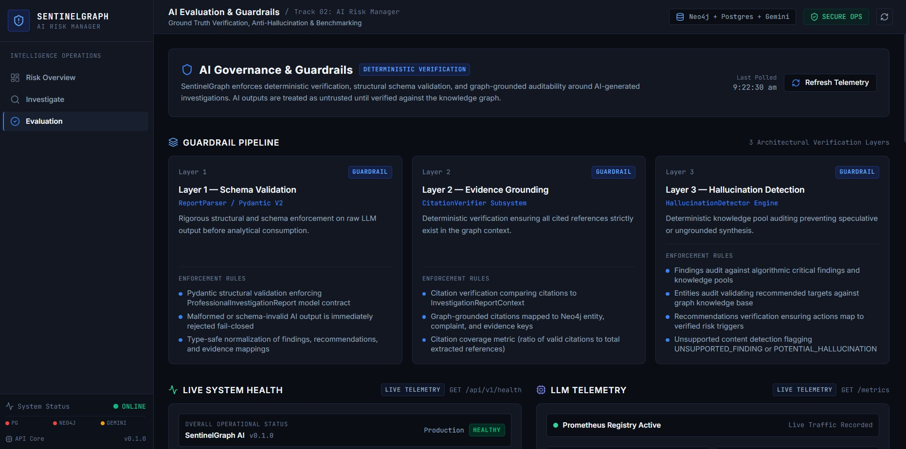

# 🛡️ SentinelGraph AI: AI Evaluation & Governance Framework

## 1. Architectural Distinction: Offline Harness vs Frontend Console

A critical architectural distinction in SentinelGraph AI is the separation between the **Offline Evaluation Test Harness** and the **Frontend AI Governance Console**:

```
┌────────────────────────────────────────────────────────┐
│      OFFLINE EVALUATION HARNESS (Backend Package)      │
│  Location: backend/app/evaluation/                     │
│  • Executed via pytest, CLI scripts, and CI runners    │
│  • Programmatic benchmarks (Latency, Tokens, Scenarios)│
│  • Algorithmic verification against golden ground truth│
│  • NOT exposed as a live production REST API endpoint  │
└────────────────────────────────────────────────────────┘
                           ▲
                           │ Visualizes Specs & Telemetry
                           │
┌────────────────────────────────────────────────────────┐
│       FRONTEND AI GOVERNANCE CONSOLE (Web UI)          │
│  Location: frontend/src/pages/EvaluationPage.tsx       │
│  Route: http://localhost:5173/#evaluation              │
│  • Visualizes the 3-Layer Guardrail Architecture       │
│  • Displays specifications for the 5 Golden Scenarios  │
│  • Explains the Evaluation Scorecard & Formulas        │
│  • Live-polls Prometheus telemetry (/metrics)          │
└────────────────────────────────────────────────────────┘
```

* **The Evaluation Subsystem** (`app/evaluation`) is an automated testing, benchmarking, and quality-assurance harness. It does not expose a public `/api/v1/evaluation` endpoint; it is designed for regression testing and CI verification.
* **The Governance Page** (`#evaluation` in the web application) is an interactive auditor console that communicates the system's safety posture, provides transparent inspection of benchmark specifications, and displays real-time Prometheus telemetry.


*Frontend AI Governance & Guardrails Console (`#evaluation`) visually mapping the 3-layer guardrail architecture, 5 golden benchmark scenarios, and live operational metrics.*

---

## 2. The 3-Layer AI Guardrail Architecture

To ensure total factual grounding and regulatory compliance, SentinelGraph AI implements a deterministic three-layer verification pipeline:

```
                  Raw LLM Generation Output
                              │
                              ▼
        ┌───────────────────────────────────────────┐
        │     Layer 1: Strict Schema Validation     │
        │  • Pydantic V2 Model Invariants           │
        │  • Field Type & Constraint Enforcement    │
        │  • Rejection of Unstructured Responses   │
        └─────────────────────┬─────────────────────┘
                              │ Validated JSON
                              ▼
        ┌───────────────────────────────────────────┐
        │     Layer 2: Evidence Grounding Audit     │
        │  • CitationVerifier Subsystem             │
        │  • All citations checked against graph ctx│
        │  • Verification of entity/complaint IDs   │
        └─────────────────────┬─────────────────────┘
                              │ Grounded Citations
                              ▼
        ┌───────────────────────────────────────────┐
        │   Layer 3: Hallucination Detection Engine │
        │  • HallucinationDetector Subsystem        │
        │  • Findings audited against knowledge pool│
        │  • Recommendations checked vs risk triggers│
        │  • Unsupported assertions flagged & killed│
        └─────────────────────┬─────────────────────┘
                              │
                              ▼
                 Certified Investigation Dossier
```

### Layer 1: Schema Validation (Syntactic Integrity)
* Handled by Pydantic V2 schemas ([`ProfessionalInvestigationReport`](file:///c:/Devesh/DeveshChauhan/Devesh%20Chauhan/sentinelgraph-ai/backend/app/schemas/report.py)).
* Validates that the LLM adhered to required fields: `report_id`, `risk_level`, `risk_justification`, `findings`, `recommendations`, and `citations`.
* Enforces that `risk_level` matches the allowed enumeration (`CRITICAL`, `HIGH`, `MEDIUM`, `LOW`, `INFORMATIONAL`).
* Rejects any conversational preamble or non-JSON wrapper text.

### Layer 2: Evidence Grounding ([`CitationVerifier`](file:///c:/Devesh/DeveshChauhan/Devesh%20Chauhan/sentinelgraph-ai/backend/app/evaluation/citation_verifier.py))
* Compares every cited identifier in the report against the known entities and complaints in the `InvestigationReportContext`.
* **Citation Invariant**: If a finding cites `+919876543210` or `C-101`, that identifier **must** strictly exist in the graph context passed to the model.
* Calculates **Citation Coverage** (ratio of verified cited findings to total findings).

### Layer 3: Hallucination Detection ([`HallucinationDetector`](file:///c:/Devesh/DeveshChauhan/Devesh%20Chauhan/sentinelgraph-ai/backend/app/evaluation/hallucination_detector.py))
* Audits generated findings against the algorithmic critical findings pool.
* Validates that target entities mentioned in recommendations exist in the verified graph knowledge base.
* Flags unsupported speculative content as `UNSUPPORTED_FINDING` or `POTENTIAL_HALLUCINATION`.
* Ensures that recommended actions map directly to verified risk triggers (e.g. freezing an account only if multi-complaint reuse exceeds thresholds).

---

## 3. The Five Golden Investigation Scenarios

The evaluation package maintains five fixed, reproducible benchmark scenarios in [`golden_dataset.py`](file:///c:/Devesh/DeveshChauhan/Devesh%20Chauhan/sentinelgraph-ai/backend/app/evaluation/golden_dataset.py):

| Scenario ID | Name & Target | Expected Risk | Expected Citations | Audit Purpose |
| :--- | :--- | :--- | :--- | :--- |
| **`SIMPLE_FRAUD_CASE`** | Simple Fraud Case<br>`+919876543210` (phone) | **`HIGH`** | `C-101`, `C-102`, `EVD-001`, `+919876543210` | Verifies deterministic dual-complaint correlation and phone entity citation matching. |
| **`ENTITY_REUSE_CASE`** | Entity Reuse Case<br>`scammer@upi` (upi) | **`CRITICAL`** | `C-101`..`C-105`, `EVD-002`, `EVD-003`, `scammer@upi` | Tests multi-complaint aggregation across 5 incidents and urgent financial credential freeze triggers. |
| **`LARGE_FRAUD_RING`** | Large Fraud Ring<br>`RING-999` (fraud_ring) | **`CRITICAL`** | `RING-999`, `C-101`, `C-102`, `C-103`, `EVD-010` | Audits network expansion detection, 15-node graph syndicate clustering, and law enforcement referral. |
| **`DISCONNECTED_ENTITY_CASE`** | Disconnected Entity Case<br>`DISCONNECTED-001` (entity) | **`LOW`** | `DISCONNECTED-001` | **Negative Control Benchmark**: Validates that isolated entities produce zero hallucinated edges and strictly low risk scores. |
| **`MINIMAL_COMPLAINT_CASE`** | Minimal Complaint Case<br>`C-MINIMAL-01` (complaint)| **`INFORMATIONAL`** | `C-MINIMAL-01` | **Data Limitation Benchmark**: Verifies that sparse data triggers explicit limitation disclosures and prevents algorithmic extrapolation. |

---

## 4. Evaluation Dimensions & Scorecard Formulas

The [`ReportQualityEvaluator`](file:///c:/Devesh/DeveshChauhan/Devesh%20Chauhan/sentinelgraph-ai/backend/app/evaluation/quality_evaluator.py) scores generated reports across five weighted dimensions:

```
┌────────────────────────────────────────────────────────────────────────┐
│                   REPORT QUALITY EVALUATION FORMULA                    │
│                                                                        │
│   Score = 0.20 × (Schema Compliance)                                  │
│         + 0.25 × (Citation Precision & Coverage)                       │
│         + 0.25 × (Hallucination Absence)                               │
│         + 0.15 × (Risk Level Alignment)                                │
│         + 0.15 × (Evidence Utilization Rate)                           │
└────────────────────────────────────────────────────────────────────────┘
```

### Mathematical Dimension Specifications

1. **Schema Compliance (20% Weight)**:
   * Binary check ($1.0$ or $0.0$) verifying complete Pydantic V2 schema adherence without missing required fields or type violations.
2. **Citation Precision & Coverage (25% Weight)**:
   $$\text{Score} = \frac{\text{Verified Citations in Context}}{\max(1, \text{Total Extracted Citations})}$$
   Penalizes any citation that references an entity or complaint ID not in the ground-truth context.
3. **Hallucination Absence (25% Weight)**:
   $$\text{Score} = 1.0 - \min\left(1.0, \frac{\text{Hallucinated Entities} + \text{Unsupported Claims}}{\text{Total Findings}}\right)$$
   Measures the absence of speculative assertions or invented network nodes.
4. **Risk Level Alignment (15% Weight)**:
   * Asserts exact string equality between the model's reported `risk_level` and the deterministic engine's `expected_risk_level`. Any deviation results in $0.0$ score for this dimension.
5. **Evidence Utilization Rate (15% Weight)**:
   $$\text{Score} = \frac{\text{Context Evidence Units Referenced in Report}}{\text{Total Context Evidence Units}}$$
   Measures how thoroughly the report utilizes available graph evidence rather than giving generic summaries.

---

## 5. Performance Benchmarking & Offline Test Execution

The evaluation suite includes a dedicated performance benchmarking engine ([`PerformanceBenchmarker`](file:///c:/Devesh/DeveshChauhan/Devesh%20Chauhan/sentinelgraph-ai/backend/app/evaluation/benchmarking.py)) that profiles latency, token throughput, and serialization overhead.

### Running the Offline Evaluation Suite
Execute the evaluation suite from the `backend/` directory using pytest:

```bash
# Run all evaluation and golden dataset tests
pytest tests/test_golden_dataset.py \
       tests/test_citation_verifier.py \
       tests/test_hallucination_detector.py \
       tests/test_quality_evaluator.py \
       tests/test_performance_benchmarks.py -v
```

### Sample Evaluation Benchmark Output
```text
============================= test session starts =============================
tests/test_golden_dataset.py::test_golden_scenarios_loading PASSED
tests/test_golden_dataset.py::test_golden_simple_fraud_case PASSED
tests/test_golden_dataset.py::test_golden_entity_reuse_case PASSED
tests/test_golden_dataset.py::test_golden_large_fraud_ring PASSED
tests/test_golden_dataset.py::test_golden_scenario_immutability PASSED
tests/test_citation_verifier.py::test_valid_citations_pass PASSED
tests/test_citation_verifier.py::test_hallucinated_citation_rejected PASSED
tests/test_hallucination_detector.py::test_unsupported_finding_detected PASSED
tests/test_quality_evaluator.py::test_quality_scorecard_calculation PASSED
tests/test_performance_benchmarks.py::test_benchmark_metrics PASSED
============================== 10 passed in 2.14s =============================
```
