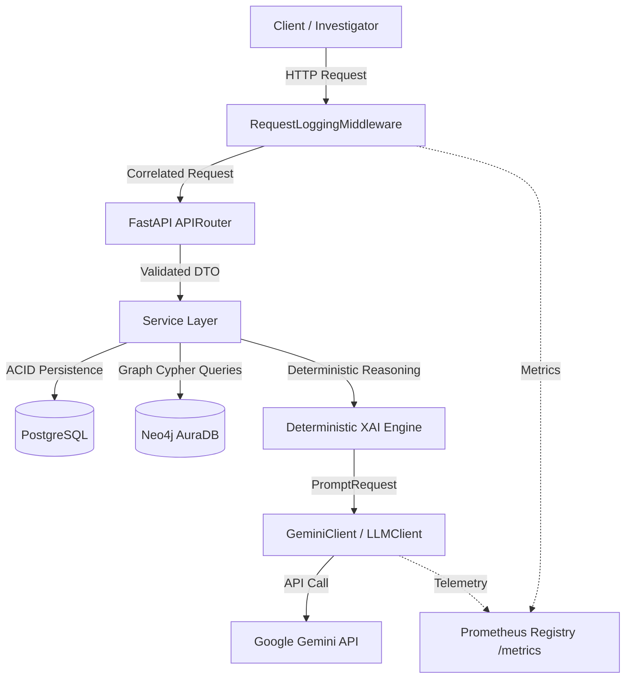

# SentinelGraph AI: System Architecture Specification

## 1. System Overview

**SentinelGraph AI** is an AI-powered Fraud Intelligence and Investigation platform designed for digital public safety (tackling counterfeiting, financial fraud, and digital arrest scams).

The core of the system is a high-performance, asynchronous **FastAPI backend** running in Python 3.13+. It ingests unstructured fraud complaint records, stores them transactionally, builds an entity relationship knowledge graph, synthesizes deterministic investigation findings, and generates explainable, audit-ready AI investigation reports.

### Major Infrastructure Components
* **FastAPI Application Server**: Asynchronous HTTP API gateway providing routing, middleware, validation, and lifecycle management.
* **PostgreSQL Relational Database**: Transactional primary storage for complaint records, incident metadata, and relational audit logs.
* **Neo4j AuraDB (Property Graph Database)**: Graph database modeling fraud actors, identifiers, bank accounts, UPI handles, and their multi-hop relationships.
* **Google Gemini SDK**: AI inference client utilized strictly for structured entity extraction and final formatted report generation.
* **Prometheus Metrics Engine**: Default registry collecting HTTP traffic, application latency distributions, and LLM inference telemetry.



---

## 2. Architectural Style

SentinelGraph AI is built as a modular monolithic backend adhering to **Clean Architecture** and the **Repository-Service Pattern**:

```text
backend/app/
├── api/             # API Routers, endpoints, and dependency injection
├── core/            # Config, logging, middleware, context, metrics, health
├── db/              # SQLAlchemy async session management & base models
├── graph/           # Neo4j client connection and Cypher query definitions
├── models/          # Relational ORM models (PostgreSQL)
├── repositories/    # Data access abstraction layer for database operations
├── schemas/         # Pydantic validation models, DTOs, and view models
├── services/        # Business logic, graph analytics, and investigation engines
├── ai/              # Provider-agnostic LLM interface & Gemini client
└── prompts/         # Versioned prompt templates and builder utilities
```

### Layer Breakdown
1. **API / Router Layer (`app/api/`)**: Defines FastAPI routes (`/complaints`, `/investigation`, `/graph`, `/analytics`, `/timeline`, `/health`, `/metrics`). Responsible for request validation, status codes, and invoking services.
2. **Service / Application Layer (`app/services/`)**: Orchestrates business logic, timeline construction, entity analysis, fraud evolution modeling, evidence synthesis, and report generation without direct database coupling.
3. **Repository / Data-Access Layer (`app/repositories/`, `app/graph/`)**: Encapsulates persistence logic. Provides clean async interfaces for SQLAlchemy ORM queries and Neo4j Cypher graph queries.
4. **Infrastructure / Integration Layer (`app/core/`, `app/ai/`, `app/db/`)**: Manages external boundaries (database drivers, Gemini SDK client, logging configuration, Prometheus metric collectors).
5. **Dependency Injection & Settings (`app/api/dependencies.py`, `app/core/config.py`)**: Uses FastAPI's `Depends` for loose coupling (injecting services and database sessions) and `pydantic-settings` for typed environment configuration.

---

## 3. End-to-End Request Flow

When an HTTP request enters the backend, it traverses the following deterministic lifecycle:

```text
1. Inbound Request
       │
2. RequestLoggingMiddleware (Assigns/validates X-Request-ID, binds ContextVar & Loguru)
       │
3. Route Match & Schema Validation (Pydantic models validate input payload)
       │
4. Service Layer Execution (Executes business operations, transactional logic)
       ├───► PostgreSQL (Persists complaint data / relational states)
       ├───► Neo4j (Queries multi-hop graph neighborhoods / fraud clusters)
       └───► Deterministic XAI Pipeline (Builds structured InvestigationSummary)
                 │
5. LLM Client Request (If report generation requested)
       ├───► Start time recorded via time.perf_counter()
       ├───► Asynchronous execution via Google GenAI SDK (60s timeout)
       ├───► Observation recorded on llm_request_duration_seconds in finally block
       └───► Token counts recorded on llm_tokens_total
                 │
6. ReportParser (Validates JSON schema, verifies structure, attaches telemetry)
       │
7. Outbound Response (Header X-Request-ID injected, HTTP latency observed on Prometheus)
```

---

## 4. Dual-Database Data Architecture

SentinelGraph AI employs a **Hybrid Dual-Database Model** where PostgreSQL and Neo4j fulfill distinct, specialized roles:

| Dimension | PostgreSQL (Relational) | Neo4j AuraDB (Property Graph) |
| :--- | :--- | :--- |
| **Primary Role** | Transactional source of truth & audit store | Relational intelligence & multi-hop link analysis |
| **Data Stored** | Complaints, raw incident text, victim records, timestamps | Fraud entities (Phones, UPI IDs, Accounts) and edges |
| **Access Pattern** | ACID transactions, index lookups, Alembic migrations | Cypher graph traversals, shortest-path, ring detection |
| **Schema Management** | Strict schema enforced via SQLAlchemy & Alembic | Labeled Property Graph (`(:Complaint)-[:MENTIONS]->(:Entity)`) |

### Synchronization Flow & Graph Topology
1. When a complaint is registered (`POST /api/v1/complaints`), the raw incident record is transactionally persisted in **PostgreSQL**.
2. Extracted fraud entities (phone numbers, UPI IDs, emails, bank accounts, organizations, persons, URLs, locations) are synchronized into **Neo4j** as graph nodes.
3. Directed **`MENTIONS`** relationships are created, directly linking each complaint to its extracted entities (`(:Complaint)-[:MENTIONS]->(:Entity)`).

> [!NOTE]
> **Implemented Graph Topology**: `MENTIONS` is the only relationship type persisted in Neo4j. Multi-hop fraud network intelligence (such as shared identifiers, fraud rings, and shortest paths) is evaluated by traversing multiple `MENTIONS` edges (e.g., `(:Complaint)-[:MENTIONS]->(:Entity)<-[:MENTIONS]-(:Complaint)`). Higher-level concepts like entity association, fund flows, or co-occurrence are analytical constructs computed dynamically by query traversals and deterministic reasoning services rather than separate persisted relationship types.

---

## 5. AI & Graph-RAG Integration

SentinelGraph AI follows a strict **Explainable AI (XAI)** paradigm:
> **The deterministic Python backend owns 100% of the investigation reasoning; the LLM owns 0% of the reasoning.**

* The LLM operates solely as a technical, constrained report writer.
* Investigation metrics, risk scores, timeline milestones, and evidence citations are computed deterministically prior to invoking the LLM.
* The LLM client never queries databases directly, preventing prompt injection vulnerabilities.

> [!NOTE]
> For the complete specification of the deterministic pipeline, prompt fingerprinting, citation tracking, and evaluation suite, refer to [`AI_ARCHITECTURE.md`](AI_ARCHITECTURE.md).

---

## 6. Observability & Telemetry Framework

The backend implements end-to-end distributed tracing, structured logging, and metrics exposition:

### 1. Request Correlation & Tracing
* **`RequestLoggingMiddleware`**: Extracts or generates an `X-Request-ID` (UUID4) for every HTTP request.
* **Context Propagation**: Stored in asynchronous `ContextVar` (`app.core.context`) ensuring cross-task context isolation.
* **Structured Logs**: Loguru logger automatically includes `request_id` in every log record.
* **Response Header**: Injects `X-Request-ID` into every HTTP response for client-side correlation.

### 2. Prometheus Metrics (`/metrics`)
Metrics are registered in the default Prometheus registry and exposed at `GET /metrics`:

* **HTTP Traffic**:
  * `http_requests_total`: Counter tracking volume by `method`, `path` (parameterized template route), and `status_code`.
  * `http_request_duration_seconds`: Histogram tracking HTTP latency distributions across `HTTP_REQUEST_DURATION_BUCKETS`.
* **LLM Inference Telemetry**:
  * `llm_requests_total`: Counter tracking completion calls by `provider`, `model`, and `status` (`success` / `error`).
  * `llm_request_duration_seconds`: Histogram measuring execution duration with `LLM_REQUEST_DURATION_BUCKETS`, guaranteed to observe exactly once via `try...finally`.
  * `llm_tokens_total`: Counter recording token consumption partitioned by `provider`, `model`, and `type` (`prompt` / `completion`).

---

## 7. Health & Readiness Subsystem

The application provides a modular, dependency-aware health checking subsystem (`app/core/health/`):

```text
GET /health        -> Aggregated health diagnostic (status of PostgreSQL, Neo4j, Gemini SDK)
GET /health/live   -> Liveness probe (verifies FastAPI process is alive and responsive)
GET /health/ready  -> Readiness probe (verifies critical dependencies are reachable for traffic)
```

* **Concrete Checkers**:
  * `PostgresHealthChecker`: Executes async connectivity probe against PostgreSQL.
  * `Neo4jHealthChecker`: Executes session verification query against Neo4j AuraDB.
  * `GeminiHealthChecker`: Validates SDK client configuration and API connectivity.
* **`HealthService`**: Aggregates checks asynchronously and concurrently, evaluating overall status (`HEALTHY`, `DEGRADED`, or `UNHEALTHY`) with timeout protection.

---

## 8. Testing & Quality Assurance

SentinelGraph AI maintains rigorous automated verification standards:

* **Unit & Integration Testing**: Comprehensive test suite driven by `pytest` and `pytest-asyncio` (`tests/`), covering health checks, middleware isolation, Prometheus metric exposition, schema contracts, parser resilience, and investigation report generation.
* **Static Analysis & Linting**: `ruff` enforces PEP 8 compliance, import sorting, and code style.
* **Continuous Integration**: GitHub Actions workflow (`.github/workflows/ci.yml`) runs linting and the complete test suite on all pull requests and pushes to `main`.

---

## 9. Containerization & Deployment

The repository provides production-ready containerization infrastructure:

* **`backend/Dockerfile`**: A multi-stage Docker build:
  * *Builder Stage*: Python 3.13-slim image compiling C extensions and installing isolated dependencies into `/opt/venv`.
  * *Runner Stage*: Minimal runtime container copying the virtual environment, creating a non-privileged system user (`appuser:10001`), creating `/app/logs`, and executing via `uvicorn app.main:app`.
* **`backend/docker-compose.yml`**: Local and staging orchestration running the FastAPI application alongside a healthy PostgreSQL 16 service with volume persistence.
* **Configuration Management**: Fully driven by environment variables (`.env.example`) parsed and validated via Pydantic settings.

---

## 10. Related Documentation & Specifications

* [`README.md`](../README.md): Project overview, feature showcase, screenshots, and setup instructions.
* [`AI_ARCHITECTURE.md`](AI_ARCHITECTURE.md): Deep architectural specification of the deterministic XAI pipeline, evaluation suite, and prompt fingerprinting.
* [`docs/DATABASE.md`](DATABASE.md): Detailed database schema documentation for PostgreSQL and Neo4j property graph models.
